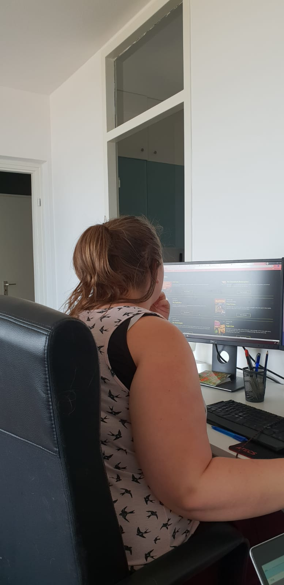

# frontend voor designers - opdracht 3

Elisa Timmerman | 500772842 | Frontend for Designers | V. van Gemert | 09-04-2019

Opzet
Om te kijken hoe json werkt heb ik even met het bestand gespeeld. Allereerst heb ik een schets gemaakt met hoe de pagina eruit moet komen te zien. Vervolgens heb ik de basis elementen in HTML gezet. Daarna heb ik gekeken naar het json bestand gekeken. Het is mij gelukt om de eerste woorden van de titel online te krijgen. Helaas kon ik niet verder komen.

Samen met mijn broertje is het gelukt om de content online te krijgen. Daarna heb ik de overzichtspagina samengesteld en opgemaakt. Om een nieuwe HTML-pagina te linken met Javascript, is mij niet gelukt.

Testen

Om erachter te komen of een leek mijn website zou begrijpen, heb ik een test gedaan. De feedback: De eerste pagina is heel duidelijk, je hebt een overzicht van films en je kan kiezen voor meer informatie. Als ik klik op meer informatie dan krijg ik ook meer informatie, dat is fijn. Ik kan van daaruit alleen niet meer terug naar het overzicht van de films. Daarnaast staan de cijfers van de reviews erg ver onder de namen waardoor ze een beetje zweven. Ik denk als ze wat dichterbij staan dat ze dan meer eenheid hebben met elkaar.

Wat heb ik ermee gedaan? 
Ik kan geen nieuwe HTML-pagina linken met Javascript. Ik kan dus niet oplossen dat je niet terug naar de overzichtspagina kan. 

Ze zegt ook dat ze denkt dat de reviews cijfers bij de acteurs horen. Dit is niet het geval. Daarom heb ik gekeken of ik de reviews apart kan onderscheiden van de acteurs. Nu zitten de reviews in een blok waardoor je het goed kan onderscheiden van elkaar.

Daarnaast heb ik nog een eventListener met de enter knop aangemaakt. Hierdoor kan de gebruiker op de detailpagina van de film op enter klikken. Er verschijnt dan een nieuwe pagina waarin de trailer wordt afgespeeld.

Link: https://elisatimmerman.github.io/frontendvoordesigners/opdracht3/Elisa/
